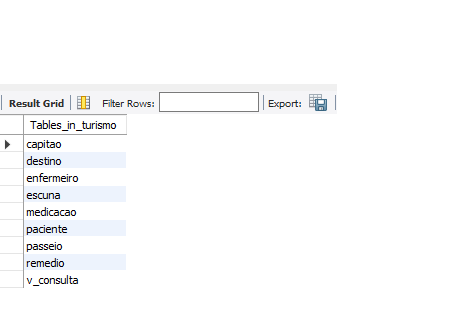
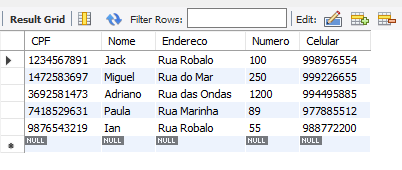
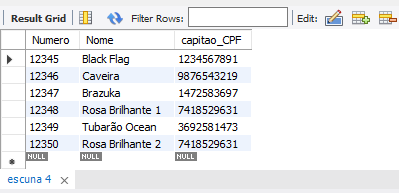
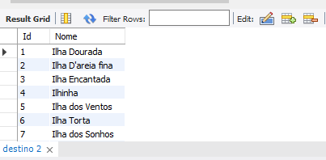
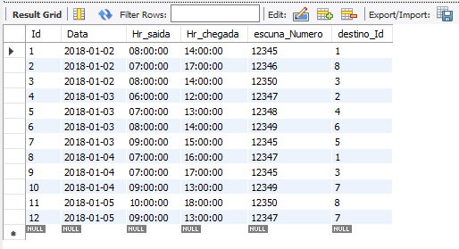
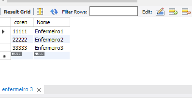
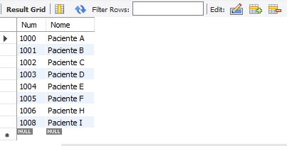
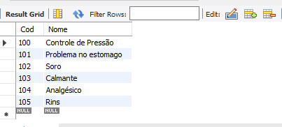
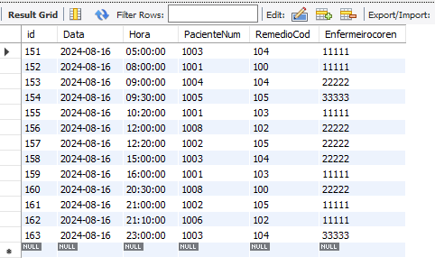

# Projeto de Banco de Dados Turístico

Este projeto contém um banco de dados MySQL desenvolvido para gerenciar passeios turísticos, incluindo informações sobre capitães, escunas, destinos, e medicamentos para os passageiros.

## Estrutura do Banco de Dados

O banco de dados é composto por várias tabelas inter-relacionadas que armazenam diferentes tipos de dados. A seguir estão as tabelas e suas descrições:

### 1. Tabela `capitao` 
  
Armazena informações dos capitães responsáveis pelas escunas.
- **CPF**: Chave primária (bigint)
- **Nome**: Nome do capitão (varchar)
- **Endereço**: Endereço do capitão (varchar)
- **Número**: Número da residência (int)
- **Celular**: Número do celular (bigint)

### 2. Tabela `escuna`
  
Armazena informações das escunas (barcos) utilizadas nos passeios.
- **Número**: Chave primária (int)
- **Nome**: Nome da escuna (varchar)
- **capitao_CPF**: Chave estrangeira que referencia o CPF do capitão (bigint)

### 3. Tabela `destino`
  
Armazena os destinos turísticos disponíveis.
- **Id**: Chave primária com auto-incremento (int)
- **Nome**: Nome do destino (varchar)

### 4. Tabela `passeio`
  
Registra os passeios realizados, incluindo data, horário, escuna, e destino.
- **Id**: Chave primária com auto-incremento (int)
- **Data**: Data do passeio (date)
- **Hr_saida**: Hora de saída (time)
- **Hr_chegada**: Hora de chegada (time)
- **escuna_Numero**: Chave estrangeira que referencia a escuna (int)
- **destino_Id**: Chave estrangeira que referencia o destino (int)

### 5. Tabelas Relacionadas à Saúde
- **`Enfermeiro`**: Armazena informações dos enfermeiros responsáveis pela administração de medicamentos.
    
- **`Paciente`**: Registra informações dos pacientes. 
    
- **`Remedio`**: Contém os medicamentos disponíveis. 

- **`Medicacao`**: Registra a administração de medicamentos, relacionando pacientes, enfermeiros e remédios. 

### 6. Tabela `Vendas`
Armazena informações sobre vendas de pacotes turísticos.
- **Número**: Chave primária com auto-incremento (int)
- **DestinoId**: Chave estrangeira que referencia o destino (int)
- **Embarque**: Data de embarque (date)
- **Qtd**: Quantidade de pacotes vendidos (int)

